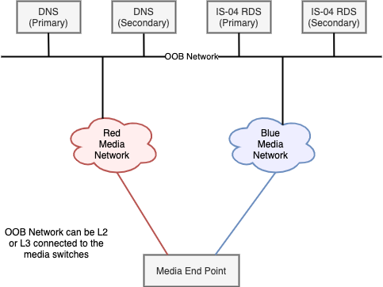

# AMWA INFO-004 NMOS Implementation Guide for DNS-SD: Introduction
{:.no_toc}

- This will be replaced with a table of contents
{:toc}

This Implementation Guide provides help for installing, setting up and testing DNS-SD services for an NMOS deployment.  

This page gives an introduction, and discusses possible architectures. We also provide a [practical example HOWTO](Example%20HOWTO.md) for setting up a BIND9 server and reference for other DNS servers.

>The Guide is a living document and suggestions, corrections or other input is welcome at all times.
>
> To provide feedback, please create an issue at <https://github.com/AMWA-TV/nmos-dns-sd-implementation-guide/issues>. We look forward to your feedback.

## NMOS and DNS-SD

End-points in the NMOS environment need to be able to find the Registration and Discovery Instances (RDIs) that make up the Registration and Discovery System (RDS). This can be accomplished by statically configuring endpoints with the IP address of the RDS, but a simpler more flexible method is to use service discovery via DNS (DNS-SD).

DNS (Domain Name System) provides a mechanism that allows end-points to resolve IP addresses from hostnames. DNS-SD provides the additional ability to discover hosts that provide specific network services from service type records.

DNS-SD can be achieved using mDNS (multicast DNS) which is a very simple serverless peer-to-peer technology. This works well for small flat (layer 2) networks, but does not scale well to larger layer 3 networks that we generally see for ST2110 implementations.

An alternative to mDNS is to use a unicast, server-based name resolution service, with requests and queries being provided over routable unicast transport. This alternative provides scalability and integration into the wider IT infrastructure allowing, for example, the use of DHCP to dynamically update DNS records.

For most ST2110 systems, unicast DNS-SD methodology provides the most appropriate choice. DNS-SD’s unicast, routable characteristics provide scalability, and removes the inherent mDNS limitation of operation only within a subnet.

DNS-SD provides discoverability of the RDS server(s). The availability of DNS also makes operations and discovery of misconfigurations simpler by making it possible to use and view hostnames rather than IP addresses. In addition, if DHCP is used in the ST2110 system, then the coupling of the DHCP system and the DNS infrastructure will further simplify operations and debugging by providing human readable abstractions of IP addresses.

The following items highlight key aspects of use of DNS-SD in conjunction with DHCP:

- Hosts can find the DNS address through DHCP, or the DNS server IP address can be provided directly to a host via configuration.
- Hosts make service discovery requests of DNS, for the service _nmos-register._tcp
- The result will typically be an RDS hostname, or set of RDS hostnames
- Hosts request DNS to resolve RDS hostname(s)
- Hosts can now talk to RDS(s) via the resolved IP addresses.

This document will focus on the “media DNS”. The media DNS is responsible only for DNS on the media sub-system. If necessary, the media DNS can be configured to forward non-local DNS requests to a corporate DNS server further up the line to resolve items not local to the media network.

This document will describe how to architect and setup a DNS environment to provide a robust, highly available DNS-SD service within an ST 2110 environment, with the objective of enabling the ANWA NMOS IS-0X suite. Additional details for setting up specific DNS-SD servers with practical hints can be found as part of the Example HOWTO in the next section. This guide gives specific information needed to setup particular infrastructure such as config files for particular DNS-SD supporting software.

## Infrastructure Requirements

General NMOS end-points and controllers come in many flavours, and there is no vendor consensus regarding from which interfaces the end-points will perform their DNS queries. For this reason, a generic design should provide the ability for end-points to access DNS services via both media interfaces, and device management interfaces.

Given the importance of being able to register with the RDS, it follows that the DNS infrastructure is a critical service, and must be able to continue to function with high availability.

In order to be usable in a production ST 2110 environment, the DNS system must have the following characteristics:

- Resilient in the face of a DNS server failure
- Resilient in the face of switch / connectivity failure
- Able to serve end-points via Red and/or Blue media interfaces
- Able to serve end-points via OOB interfaces (Out Of Band / non media interfaces)

## DNS Resilience

DNS resilience is clearly vital in this environment. There are a number of methods that can be used to achieve resiliency.

1. Main and backup DNS servers. Hosts are provided with both DNS server addresses. This is simple, but requires end-points to have both IP addresses, and to be able to cut over, when the main server is not reachable. Depending on end-point implementation, there may be a delay between the time a DNS becomes unreachable, and a host cutting over.
2. Multiple DNS servers run with a shared virtual address. This has the advantage of being very simple for the end-point - only a single IP address needs to be provisioned. The availability of this mode of operation is subject to it being supported by the DNS server.
3. Multiple DNS servers can be implemented, running behind a load balancer. The load balancer presents only a single IP address to the end-points.

The right solution will depend on the exact requirements of individual projects, and the IT capabilities and infrastructure of the organisation implementing the solution. For the rest of this document, we’ll focus on the simplest to implement model (1).

## Infrastructure Proposals

There follow two examples of potential architectures.

The first, “DNS Server per Media Network” provides the identified requirements, but retains a hard separation between the Media network and the OOB network, while retaining Red / Blue separation.

The second option, “DNS Servers in the OOB Network”, follows a more traditional data center model, where the DNS services are moved onto the “OOB” services network.
The choice of one method over the other will be driven by a number of factors:

- End-point needs and capabilities
- RDS server capabilities
- Customer network design principles

## One DNS Server per Media Network

This design seeks to avoid the need for any connectivity and routing between the Red / Blue media networks, and the OOB (out-of-band network). This is achieved by providing either a DNS instance per network, or by using “ZoneScopes” to provide DNS services per interface.

This design can support end-points with Media network or OOB connectivity.

This design provides direct access to the DNS servers from the Red, Blue and OOB networks, and the RDS servers likewise live directly attached to all networks.

Three independent DNS configs are needed, Red, Blue and OOB. Each pair of DNS servers can work in Primary/Secondary mode if resilience is needed. The Primary / Secondary configuration ensures that they are running consistent setups.

If no end-points need OOB access to the DNS servers, then there is no need (except for access) to consider that network in this design.

While this design provides inherent separation between Red / Blue and OOB, it may impose some extra complexity in the configuration and capability of DNS and end-point components:

- If Red, Blue and OOB access is needed, then the separate DNS instances will be needed, or more complex “ZoneScopes” will be required to ensure that the right responces are provided to the multiple network interfaces.
- If DNS is operational on OOB and Red / Blue networks, end-points will need to capable of processing the multiple DNS responses, to determine which responses represent reachable RDS servers.

End-points can have up to two DNS server addresses configured per media network depending on the levels of resilience required (e.g. Red network):

- DNS Red (Primary)
- DNS Red (Secondary)

The cost of the Red / Blue / OOB isolation is duplication of services, and complexity in end-point capability and configuration. 2x DNS servers would be provisioned for maximum resilience, and multiple NIC’s are needed on each DNS server, to connect to the three available networks. RDS servers need to support multiple interfaces, to allow facing towards both Red and Blue, and RDS servers need to be able to operate as active-active.

## DNS Servers in the OOB Network

This is a much simpler architecture conceptually, but requires that the OOB network is reachable from the end-points - this may be less appealing to some customers who want to see “harder” separation between the media networks, and between media networks and OOB network.

Access to the DNS and RDS servers is through the common OOB network. This provides reachability for these services from both Red and Blue networks, and natively for end-points that only support OOB DNS/RDS access. As a result, the duplication of DNS servers needed in the previous design has disappeared. This also means that only one DNS config is needed, and that end-points only need to know the same two DNS addresses - irrespective of which network they are implementing the DNS lookup on - Red, Blue, or OOB.

As before, the two DNS servers are working in Primary/Secondary mode, to provide resilience.

The cost of this simplicity is that there is a need to provide reachability from the Red and Blue networks to the DNS and RDS servers.

Careful routing configuration in the network can provide this reachability in a way that would limit connectivity, and prevent any Red <-> Blue connectivity for Multicast.

The use of ACL’s would allow further fine-tuning, allowing only access to the specific servers, on the minimum required UDP ports.

If OOB to media network security needs are high, then a firewall could be placed in those paths, with the appropriate rules being installed, to allow through only RDS and DNS traffic as appropriate.

## Conclusions

This document has provided an overview of the need for DNS-SD for NMOS RDS discovery and provided details of an overall approach to use and configuration of DNS-SD in an NMOS deployment.  Additional details for setting up specific DNS-SD servers with practical hints can be found as part of the Example HOWTO in the next section.

## Abbreviations

**ACL**: Access Control List

**DHCP**: Dynamic Host Configuration Protocol

**DNS**: Domain Name System

**DNS-SD**: Domain Name System - Service Discovery

**NMOS**: Networked Media Open Specifications

**OOB**: Out of Band

**RDI**: Registration and Discovery Instance

**RDS**: Registration and Discovery System
